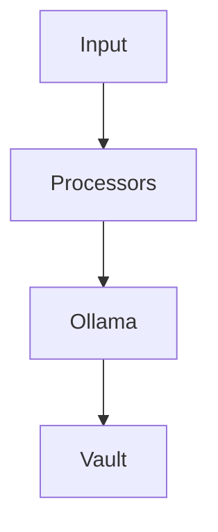

# Academic Vault Processor

README orientado a GitHub.

## Objetivo
Transformar material académico en un vault Obsidian estructurado.

## Instalación
```bash
uv sync
```

## Comandos
```bash
academic-vault init
academic-vault process
academic-vault ingest
academic-vault transcribe
academic-vault status
```

## Arquitectura
